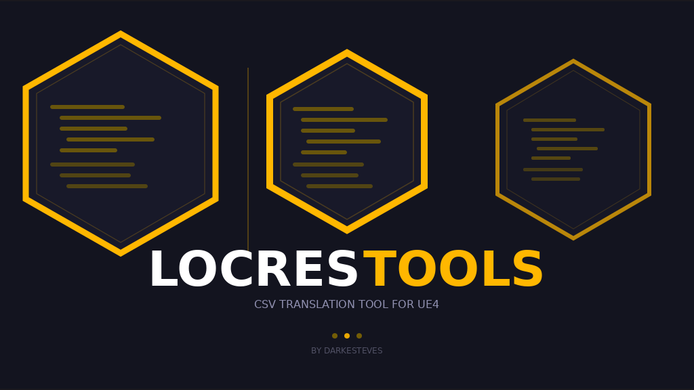

  

<h1 align="center">LocresTools</h1>

  Translation and management tool for <code>.locres</code> files of <b>Unreal Engine 4</b>-based games. 
  Ferramenta de tradução e gestão de ficheiros <code>.locres</code> de jogos baseados em <b>Unreal Engine 4</b>.

---

# Release Notes — LocresTools

---
## v1.3 — Historical draft
> First non-open-source version. Foundation for every following version.

- Export LOCRES → CSV (Import tab)
- Compare tab — column redesign
- New button style with a themed colour system
- "Import to Editor" button (Compare → Editor)
- CSV Editor tab layout with 3 file cards

🇵🇹 Português

## v1.3 — Draft histórico
> Primeira versão não open-source. Base para todas as versões seguintes.

- Exportar LOCRES → CSV (aba Importar)
- Aba Comparar — remodelação das colunas
- Novo estilo de botões com sistema de cores temáticas
- Botão "Importar no Editor" (Comparar → Editor)
- Layout da aba Editor CSV com 3 cards de ficheiro

---
## v1.4 — 2026-05-16
> Major update with a general interface overhaul.

**✨ New Features**
- Export LOCRES → CSV — new function in the Import tab
- Compare tab redesigned — Source/Target columns, colour-based filters
- New button system (`mkbtn_c`, `mkradio_c`) with themed colours
- "Import to Editor" button — imports Compare entries into the Editor
- CSV Editor — 3-card file layout (CSV, Comparison, Reference)
- CSV Editor — inline editing with double-click (Enter confirms, Esc cancels)
- Toolbar and hotkey panel in the CSV Editor
- Auto-update via GitHub Releases
- Discord Rich Presence
- 14 visual themes with dynamic loading

**🔄 Updates**
- "Status" column removed from the Compare tab (row colour indicates state)
- Window geometry saved between sessions
- Bidirectional sync Editor ↔ Reference

**🐛 Bugfixes**
- `_c_browse` was absorbed inside `_c_import_to_editor`'s body — fixed
- Multiple stability fixes in the CSV Editor

🇵🇹 Português

## v1.4 — 2026-05-16
> Grande actualização com remodelação geral da interface.

**✨ Novidades**
- Exportar LOCRES → CSV — nova função na aba Importar
- Aba Comparar remodelada — colunas Source/Target, filtros por cor
- Novo sistema de botões (`mkbtn_c`, `mkradio_c`) com cores temáticas
- Botão "Importar no Editor" — importa entradas do Comparar para o Editor
- Editor CSV — layout com 3 cards de ficheiro (CSV, Comparação, Referência)
- Editor CSV — edição inline com duplo-clique (Enter confirma, Esc cancela)
- Toolbar e painel de hotkeys no Editor CSV
- Auto-update via GitHub Releases
- Discord Rich Presence
- 14 temas visuais com carregamento dinâmico

**🔄 Actualizações**
- Coluna "Situação" removida da aba Comparar (cor da linha indica o estado)
- Geometria da janela guardada entre sessões
- Sincronização bidirecional Editor ↔ Referência

**🐛 Bugfixes**
- `_c_browse` estava absorvido no corpo de `_c_import_to_editor` — corrigido
- Múltiplas correcções de estabilidade no Editor CSV

---
## v1.5 — 2026-05-18
> Stabilisation, fixes and usability improvements.

**✨ New Features**
- Merge LOCRES tab — combines two `.locres` files into a single table
- Reference panel in the Editor (lateral PanedWindow)
- Search dialog with integrated reference panel
- Per-row colour indicators (new / modified / empty)
- Independent selection colours per table

**🔄 Updates**
- Lang files — full PT/EN support with no hardcoded strings
- Settings "Save" button inactive until changes are made
- Synchronised scroll between Editor and Reference

**🐛 Bugfixes**
- Rich Presence — toggle fix
- Multiple crash and sync fixes
- Reference panel layout corrections

🇵🇹 Português

## v1.5 — 2026-05-18
> Estabilização, correcções e melhorias de usabilidade.

**✨ Novidades**
- Aba Merge LOCRES — combina dois ficheiros `.locres` numa só tabela
- Painel de referência no Editor (PanedWindow lateral)
- Diálogo Procurar com painel de referência integrado
- Indicadores de cor por linha (nova / modificada / vazia)
- Cores de selecção independentes por tabela

**🔄 Actualizações**
- Lang files — suporte completo PT/EN sem strings hardcoded
- Botão "Guardar" inactivo nas Definições até haver alterações
- Scroll síncrono entre Editor e Referência

**🐛 Bugfixes**
- Rich Presence — correcção do toggle
- Múltiplas correcções de crash e sincronização
- Correcções no layout do painel de referência

---
## v1.6 — 2026-05-21
> Import tab redesign and theme improvements.

**✨ New Features**
- `add_tip()` — global themed tooltip function with mouse tracking
- "Insert at reference CSV positions" checkbox in the Editor panel
- Precise widget positioning with sticky and fixed margin
- Import tab — new LOCRES table + toolbar + PanedWindow
- Export CSV — separator selection (comma/tab)
- Editor — search field with filters (All/Modified/Empty)

**🔄 Updates**
- All cards converted to grid layout
- Expanded theme system with new customisation keys
- Gruvbox Dark theme improved

**🐛 Bugfixes**
- Settings window — auto-fit and icon fixed
- Info button disabled when Settings is open
- General layout and stability fixes

🇵🇹 Português

## v1.6 — 2026-05-21
> Remodelação da aba Importar e melhorias de tema.

**✨ Novidades**
- `add_tip()` — função global de tooltip temático com seguimento do rato
- Checkbox "Inserir nas posições do CSV de referência" no painel Editor
- Posicionamento preciso dos widgets com sticky e margem fixa
- Aba Importar — nova tabela LOCRES + toolbar + PanedWindow
- Exportar CSV — selecção de separador (vírgula/tabulação)
- Editor — campo de pesquisa com filtros (Todas/Modificadas/Vazias)

**🔄 Actualizações**
- Todos os cards convertidos para grid layout
- Sistema de temas expandido com novas chaves de personalização
- Tema Gruvbox Dark melhorado

**🐛 Bugfixes**
- Janela de Definições — auto-fit e ícone corrigidos
- Botão Info desactivado quando Definições está aberto
- Correcções de layout e estabilidade

---
## v1.7 — 2026-05-22
> Refined interface and introduction of Style 2 (Icon Mode).

**✨ New Features**
- **Style 2 (Button Mode)** — navigation sidebar + icon-only buttons
- Complete `_reg` registration system — all buttons, radios and checkboxes covered
- Tooltips follow the mouse cursor in real time
- Crash log — captures startup errors and unhandled exceptions

**🔄 Updates**
- Settings + Info buttons redesigned and reduced in the header
- Compare tab buttons sized to match the Editor toolbar
- Button Mode renamed from "Compact Mode" to "Button Mode"

**🐛 Bugfixes**
- Editor ↔ Reference sync fixes
- Reference panel — tooltip fixes

🇵🇹 Português

## v1.7 — 2026-05-22
> Interface refinada e introdução do Style 2 (Modo Ícone).

**✨ Novidades**
- **Style 2 (Modo Botão)** — sidebar de navegação + botões só com ícones
- Sistema de registos `_reg` completo — todos os botões, radios e checkboxes cobertos
- Tooltips seguem a ponta do rato em tempo real
- Crash log — captura erros de arranque e excepções não tratadas

**🔄 Actualizações**
- Botões Definições + Info redesenhados e reduzidos no header
- Botões da aba Comparar com dimensões igualadas ao Editor
- Modo Botão renomeado de "Modo Compacto" para "Modo Botão"

**🐛 Bugfixes**
- Correcções de sincronização Editor ↔ Referência
- Painel de referência — tooltips corrigidos

---
## v1.8 — 2026-05-22
> Transparent Button Mode and Style 2 refinements.

**✨ New Features**
- Transparent Button Mode — Style 2 sub-option; buttons without background, subtle hover with lighter text
- Exit button (⏏) in the Style 2 sidebar
- Sidebar — tab buttons with individual colours per tab

**🔄 Updates**
- Style 1 / Style 2 — clear separation of both visual modes
- Editor toolbar reorganised in Style 2
- Style 2 sub-options only active when Style 2 is enabled

**🐛 Bugfixes**
- Transparent widget registration fixed across all panels
- Hover and button states in Transparent Mode stabilised

🇵🇹 Português

## v1.8 — 2026-05-22
> Modo Botão Transparente e refinamentos do Style 2.

**✨ Novidades**
- Modo Botão Transparente — subopção do Style 2; botões sem fundo, hover subtil com texto mais claro
- Botão de saída (⏏) na sidebar em Style 2
- Sidebar — botões de aba com cores específicas por aba

**🔄 Actualizações**
- Style 1 / Style 2 — separação clara dos dois modos visuais
- Toolbar do Editor reorganizada em Style 2
- Subopções do Style 2 só activas quando Style 2 está ligado

**🐛 Bugfixes**
- Registo de widgets transparentes corrigido em todos os painéis
- Hover e estados de botão em Modo Transparente estabilizados

---
## v1.8.5 — 2026-05-23
> Minor Import tab layout revision.

**🔄 Updates**
- Import tab — action buttons repositioned: the frame moved to the column beside the 3 file cards
- "Generate LOCRES" and "Export CSV" buttons switched to a vertical layout — "Generate LOCRES" on top, "Export CSV" at the bottom
- The table (PanedWindow) now spans both columns of the tab

🇵🇹 Português

## v1.8.5 — 2026-05-23
> Pequena revisão de layout da aba Importar.

**🔄 Actualizações**
- Aba Importar — botões de acção reposicionados: frame movido para a coluna ao lado dos 3 cards de ficheiro
- Botões "Gerar LOCRES" e "Exportar CSV" passaram a layout vertical — "Gerar LOCRES" no topo, "Exportar CSV" no fundo
- A tabela (PanedWindow) passou a ocupar as duas colunas da aba

---

<i>v2.0 in development — see Changelog.txt for the latest progress.</i> 
<i>v2.0 em desenvolvimento — consultar Changelog.txt para o progresso mais recente.</i>

